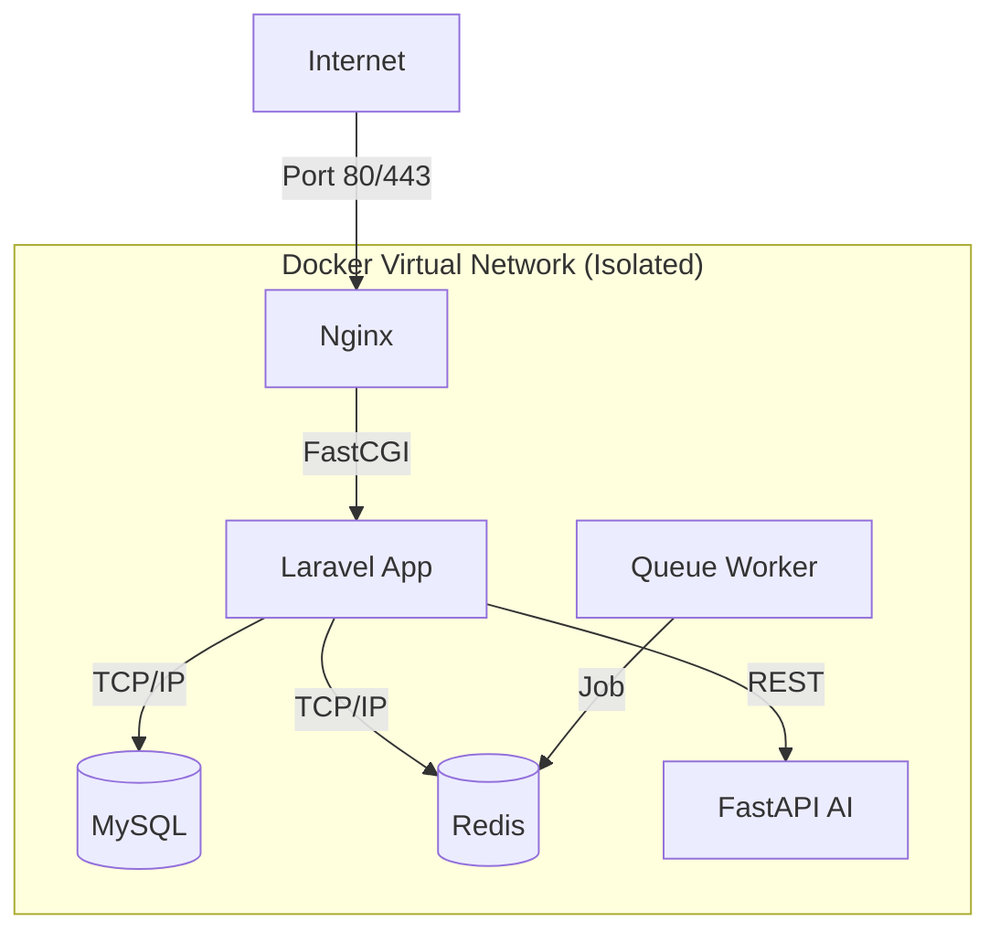

# 01. Arsitektur Sistem Terperinci

Dokumen ini memberikan panduan mendalam tentang bagaimana setiap komponen dalam **Secure Auth System** bekerja, saling terhubung, dan menjaga keamanan data.

## 🏗️ Ekosistem Micro-Service
Meskipun berjalan dalam satu server (via Docker Compose), sistem ini dirancang dengan prinsip micro-services yang terisolasi.

### 1. Web Layer (Nginx)
- **Fungsi**: Reverse Proxy dan Web Server.
- **Konfigurasi Keamanan**:
  - Mengarahkan trafik HTTPS (port 443) ke PHP-FPM (port 9000).
  - Membatasi ukuran upload dan timeout request.
  - Memblokir akses ke file sensitif secara eksplisit (`.env`, `.git`, `.docker`).
  - Menyembunyikan versi server (`server_tokens off`) untuk mencegah fingerprinting oleh scanner hacker.

### 2. Application Layer (Laravel 12 / PHP 8.4)
- **Fungsi**: Logika Bisnis, Autentikasi, dan Orkestrasi.
- **Core Components**:
  - **Service Layer**: Memisahkan logika autentikasi (`AuthService`) dari controller.
  - **Middleware**: Menangani rate limiting dan verifikasi fingerprint perangkat sebelum mencapai database.
  - **Queue (Redis)**: Mengirim email OTP secara asinkron agar proses login tetap cepat dan responsif.

### 3. AI Risk Engine (FastAPI & Python)
- **Fungsi**: Mesin Analisis Risiko Real-time.
- **Teknologi**: Menggunakan library Machine Learning modern (Scikit-Learn) untuk evaluasi data.
- **Keunggulan**: Menggunakan model **Isolation Forest** yang sangat efisien dalam mendeteksi anomali tanpa membutuhkan dataset berlabel jutaan baris (unsupervised learning).

### 4. Data Layer (MySQL & Redis)
- **MySQL 8.0**: Menyimpan data user, log audit keamanan, dan perangkat yang dipercaya. Password dienkripsi menggunakan Argon2id.
- **Redis 7.0**: Bertanggung jawab atas penyimpanan session, cache rate limit, dan antrian (queue) email.

---

## 📡 Jaringan & Isolasi (Network Security)

Sistem menggunakan **Docker Network Internal Bridge** yang terisolasi. Ini adalah pertahanan utama terhadap akses ilegal.

> [!IMPORTANT]
> **Zero-Port Exposure**: Hanya port Nginx (80/443) yang dibuka ke internet. Database, Redis, dan AI Service TIDAK memetakan port ke host luar, sehingga tidak bisa diserang langsung dari internet.

---

## 🔐 Aliran Autentikasi API Internal
Komunikasi antara Laravel dan FastAPI dilindungi oleh:
1.  **Header X-API-Key**: Setiap request Laravel wajib menyertakan kunci rahasia yang panjang (64 karakter).
2.  **Constant-time Comparison**: FastAPI memvalidasi kunci menggunakan `hmac.compare_digest()` untuk melindunginya dari *Timing Attacks*.
3.  **Local Network Bind**: Secara default, FastAPI hanya mendengarkan request dari dalam network Docker.
