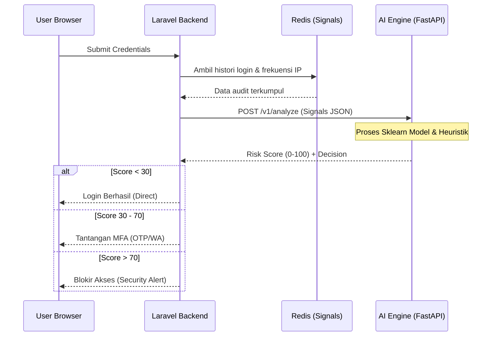

# AI Risk Engine (Neural Defense)

**AI Risk Engine** adalah otak di balik keamanan adaptif sistem ini. Layanan ini beroperasi sebagai microservice mandiri berbasis **Python/FastAPI** yang melakukan penilaian risiko secara *stateless* dan *real-time* untuk setiap upaya autentikasi.

## Arsitektur Integrasi

Sistem menggunakan pola *Request-Response* sinkron dengan strategi *Fail-Open/Fail-Safe* untuk memastikan ketersediaan layanan meskipun mesin AI mengalami kendala.

---

## Parameter Penilaian (Signals)

Laravel mengumpulkan "Signal" berikut dan mengirimkannya ke AI Engine dalam satu payload terstruktur:

| Kategori | Signal | Deskripsi |
|---|---|---|
| **Jaringan** | `ip_address` | Lokasi Geografis, Reputasi IP (Spam/Bot), dan deteksi VPN/Proxy. |
| **Perangkat** | `fingerprint` | Hash unik perangkat. Mencocokkan dengan daftar `trusted_devices`. |
| **Behavior** | `request_velocity` | Kecepatan percobaan login dari IP yang sama dalam 10 menit terakhir. |
| **Kredensial** | `failed_attempts` | Jumlah kegagalan password berturut-turut pada akun tersebut. |
| **Waktu** | `login_hour` | Anomali waktu login (misal: user biasanya login jam 09:00, tiba-tiba login jam 03:00). |

---

## Logika Pengambilan Keputusan

AI Engine tidak hanya memberikan angka, tapi juga instruksi tindakan (*Decision*):

### 1. `ALLOW` (Risiko Rendah)
- **Kondisi**: Perangkat dikenal, IP bersih, behavior normal.
- **Tindakan**: Laravel langsung memberikan sesi/token.

### 2. `OTP` / `CHALLENGE` (Risiko Menengah)
- **Kondisi**: Perangkat baru (tapi IP bersih), atau IP baru (perangkat dikenal), atau login di luar jam kerja.
- **Tindakan**: Sistem memaksa verifikasi tambahan via Email atau WhatsApp.

### 3. `BLOCK` (Risiko Tinggi)
- **Kondisi**: IP masuk blacklist, terdeteksi brute force masif, atau fingerprint terdeteksi sebagai bot simulator.
- **Tindakan**: Sistem menolak login total dan mencatat IP ke dalam `ip_blacklist` selama N jam.

---

## Ketahanan Sistem (High Availability)

Karena AI Engine adalah layanan eksternal, kami menerapkan mekanisme **Smart Fallback**:

- **Timeout Management**: Jika AI Engine tidak merespon dalam < 2 detik, Laravel akan mengambil alih keputusan menggunakan *Rule-based Logic* sederhana.
- **Circuit Breaker**: Jika AI Engine terdeteksi *down* secara berulang, sistem akan masuk ke mode `Strict-MFA` (semua login dianggap berisiko menengah sebagai tindakan pencegahan).
- **Asynchronous Learning**: Meskipun keputusan diambil real-time, data hasil login tetap dikirim ke AI Engine secara asinkron (Queue) untuk proses pembelajaran model ML di masa depan.

::: info Monitoring AI
Anda dapat memantau performa dan statistik keputusan AI melalui Dashboard Admin pada tab **Security Insights**.
:::

