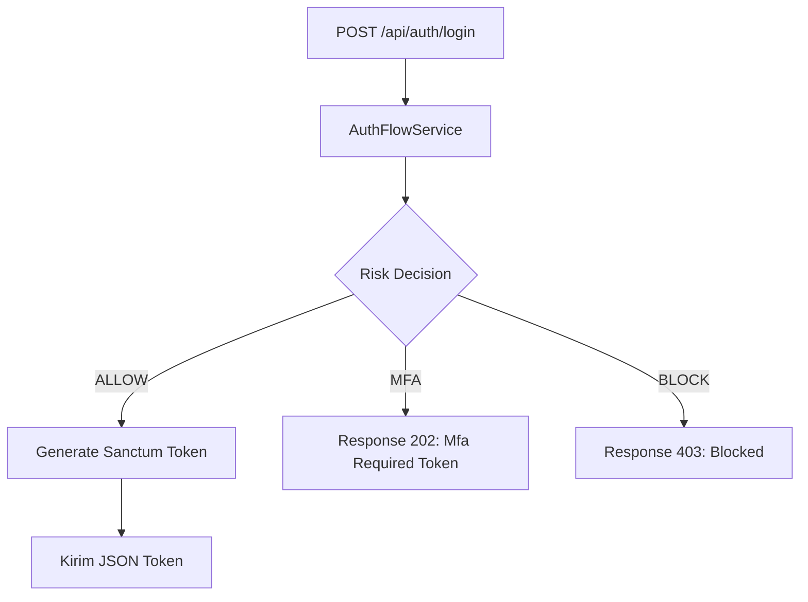

# Flow Autentikasi Utama

Halaman ini merangkum secara komprehensif alur autentikasi (_Authentication Flow_) pada _AI Auth System_, baik untuk jalur API (`/api/auth/*`) maupun Web (`/login`).

## 1. Flow Web Login

Alur ini dirancang untuk pengguna yang mengakses aplikasi melalui antarmuka peramban (browser).

```mermaid
flowchart TD
    A[POST /login] --> B{PreAuthRateLimitMiddleware}
    B -- Blocked --> Z[Response 429: Too Many Attempts]
    B -- Allowed --> C[WebAuthController: login()]
    
    C --> D[AuthFlowService: attemptLogin()]
    D --> E{Validasi Kredensial?}
    E -- Invalid --> Y[Kembali dengan Error Message]
    
    E -- Valid --> F[AI Risk Engine: evaluate()]
    F --> G{Risk Level}
    
    G -- HIGH --> X[Kunci Akun & Response 403]
    G -- MEDIUM --> H[Set Session Temporary & Redirect /auth/mfa]
    G -- LOW --> I{Cek MFA Setting User}
    
    I -- Enabled --> H
    I -- Disabled --> J[Regenerate Session & Login Sukses]
    J --> K[Redirect ke Dashboard]
```

### Langkah-Langkah Detil:
1. **Pencegahan Brute-Force**: Request melewati middleware untuk membatasi frekuensi percobaan.
2. **Kredensial**: Pengecekan kombinasi Email dan Password.
3. **AI Risk Assessment**: Mengumpulkan IP dan User-Agent, lalu mengirimkannya ke FastAPI untuk kalkulasi anomali.
4. **Keputusan Akses**: Berdasarkan skor risiko, sistem menentukan apakah mengizinkan langsung, membutuhkan MFA, atau memblokir akses.

## 2. Flow API Login (Stateless)

Alur ini digunakan oleh klien seluler (Mobile Apps) atau Single Page Applications (SPA) yang menggunakan token.



**Perbedaan Utama API vs Web:**
- API mengembalikan JSON dengan status `202 Accepted` dan `temporary_token` saat MFA dibutuhkan.
- Klien harus memanggil `POST /api/auth/mfa/verify` dengan `temporary_token` tersebut.
- API menggunakan **Laravel Sanctum** untuk menerbitkan Personal Access Token (PAT), alih-alih menggunakan Cookie/Session.

## 3. Flow Reset Password

Sistem ini mengikuti standar keamanan OWASP untuk _Password Recovery_:
1. Pengguna memasukkan email di halaman `/forgot-password`.
2. Sistem men-generate token acak yang aman dan mengikatnya ke tabel `password_reset_tokens`.
3. Email dikirim berisi _signed link_.
4. Pengguna memvalidasi token dan submit password baru (dengan validasi _password strength_).
5. Semua sesi aktif milik pengguna **dihancurkan** (force logout on other devices) untuk mencegah penyalahgunaan jika sesi lama diretas.

## 4. Titik Kontrol Keamanan Silang

Sistem memastikan bahwa kontrol keamanan tidak hanya berhenti di pintu depan.
- **Session Fingerprint**: Divalidasi di setiap HTTP request.
- **MFA Throttle**: Endpoint MFA memiliki rate limiter yang terpisah dan lebih agresif.
- **Re-Authentication**: Untuk tindakan sensitif (seperti mengubah email atau role), pengguna akan diminta memasukkan ulang sandi atau kode MFA meskipun statusnya sudah login (fitur _Sudo Mode_).
