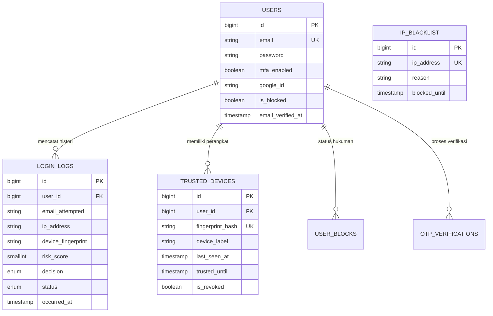

# Skema Database & Relasi Entitas

Halaman ini menyajikan cetak biru (blueprint) data dari **AI Auth System**. Skema ini dirancang untuk mendukung performa audit yang tinggi, integritas data keamanan, dan skalabilitas analitik untuk mesin AI.

## Entity Relationship Diagram (ERD)

Berikut adalah visualisasi hubungan antar tabel utama dalam sistem:

---

## Katalog Tabel Database

Berikut adalah daftar seluruh tabel yang digunakan dalam sistem beserta tanggung jawab utamanya:

| Nama Tabel | Domain | Tanggung Jawab Utama |
|---|---|---|
| `users` | Identity | Data profil pengguna, kredensial, dan preferensi keamanan. |
| `login_logs` | Security/Audit | Log audit setiap percobaan login dan keputusan AI. |
| `trusted_devices` | Security | Daftar sidik jari perangkat yang sudah diverifikasi (whitelist user). |
| `otp_verifications` | Auth/Comm | Penyimpanan sementara kode OTP (Email/WA) dan status verifikasinya. |
| `ip_blacklist` | Security | Daftar alamat IP yang diblokir secara otomatis atau manual. |
| `ip_whitelist` | Security | Daftar alamat IP pengecualian (Internal/Office/VPN). |
| `user_blocks` | Security | Status penangguhan akun pengguna (Auto-lock logic). |
| `wa_messages` | Communication | Log histori pengiriman pesan WhatsApp via gateway. |
| `roles` | Authorization | Definisi tingkatan akses (Admin, User, Security). |
| `permissions` | Authorization | Definisi aksi spesifik yang diizinkan untuk setiap Role. |

---

## Detail Struktur & Kamus Data

### 1. Tabel `users`
| Kolom | Tipe | Deskripsi |
|---|---|---|
| `id` | BigInt | Primary Key (Auto-increment). |
| `email` | String | Email unik pengguna (Login identifier). |
| `password` | String | Hash Bcrypt kata sandi. |
| `mfa_enabled` | Boolean | Status aktifasi Multi-Factor Authentication. |
| `is_blocked` | Boolean | Status pemblokiran akun secara global. |
| `google_id` | String | ID unik dari Google SSO (Nullable). |

### 2. Tabel `login_logs`
| Kolom | Tipe | Deskripsi |
|---|---|---|
| `user_id` | BigInt | Relasi ke tabel `users` (Nullable). |
| `ip_address` | IP | Alamat IP saat percobaan login dilakukan. |
| `device_fingerprint` | String | Hash unik peramban/perangkat pengguna. |
| `risk_score` | Integer | Skor risiko (0-100) dari AI Engine. |
| `decision` | Enum | Keputusan: `ALLOW`, `OTP`, `BLOCK`, `FALLBACK`. |
| `status` | Enum | Status akhir: `success`, `failed`, `blocked`, dll. |

### 3. Tabel `trusted_devices`
| Kolom | Tipe | Deskripsi |
|---|---|---|
| `user_id` | BigInt | Pemilik perangkat. |
| `fingerprint_hash` | String | Hash sidik jari perangkat tepercaya. |
| `trusted_until` | Timestamp | Batas waktu kepercayaan perangkat. |
| `is_revoked` | Boolean | Status pencabutan akses perangkat secara manual. |

### 4. Tabel `ip_blacklist`
| Kolom | Tipe | Deskripsi |
|---|---|---|
| `ip_address` | String | IP yang masuk daftar hitam. |
| `reason` | String | Alasan pemblokiran (misal: "Brute Force Detected"). |
| `blocked_until` | Timestamp | Kapan blokir akan berakhir (Null = Permanen). |

---

## Optimasi Database

Untuk menjaga performa sistem tetap stabil seiring bertambahnya data audit, kami menerapkan strategi berikut:
1. **Indexing Strategis**: Index pada kolom `ip_address`, `email_attempted`, dan `occurred_at` untuk mempercepat query statistik risiko.
2. **Database Partitioning (Opsional)**: Untuk tabel `login_logs`, disarankan melakukan partisi berbasis bulan jika jumlah baris melebihi 10 juta per bulan.
3. **Soft Deletes**: Kami menghindari penghapusan fisik pada data audit (`login_logs`) untuk menjaga integritas investigasi forensik jika terjadi insiden keamanan.

::: warning Keamanan Data (PII)
Kolom seperti `ip_address` dan `user_agent` dianggap sebagai data pribadi (PII). Pastikan akses ke database produksi dibatasi secara ketat dan audit logs dirotasi secara berkala.
:::
