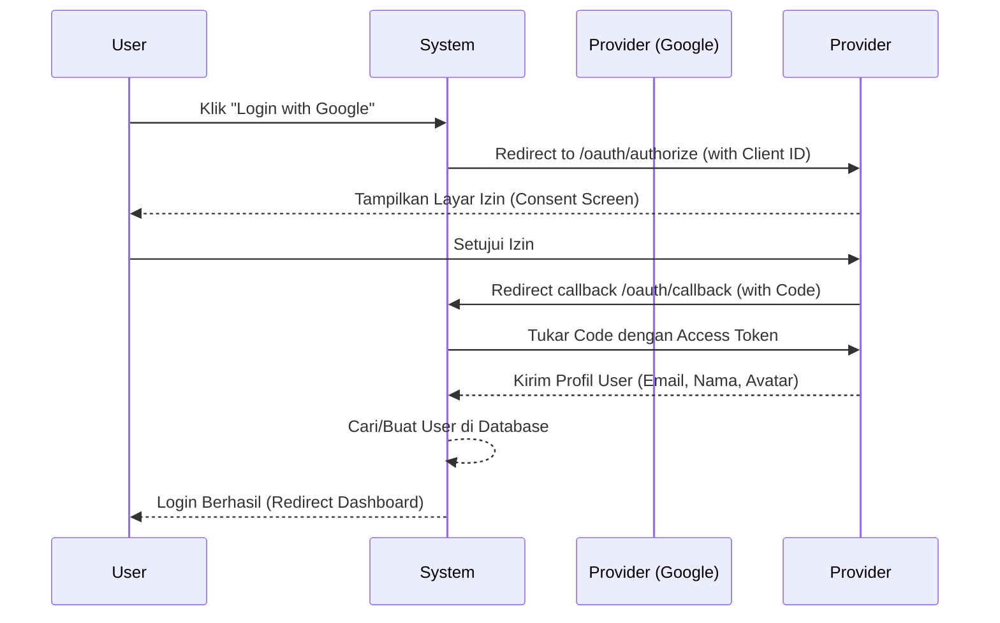

# Social Authentication (SSO)

AI Auth System mendukung mekanisme _Single Sign-On (SSO)_ menggunakan protokol OAuth 2.0 melalui layanan pihak ketiga seperti **Google** dan **GitHub**. Modul ini diimplementasikan menggunakan package `laravel/socialite`.

## Alur OAuth 2.0

Proses autentikasi sosial melibatkan tiga pihak: Sistem Kita, Provider (Google/GitHub), dan Pengguna.



## Penanganan Callback

Ketika Google/GitHub mengembalikan profil pengguna, `SocialAuthController` bertugas untuk memproses data tersebut. 

Terdapat dua skenario:
1. **Pengguna Baru**: Akun secara otomatis dibuat (_Auto-Registration_).
2. **Pengguna Lama**: Sesi login langsung diberikan tanpa perlu memasukkan kata sandi.

**Kode Implementasi Utama:**
```php {8,14}
// app/Modules/Authentication/Controllers/SocialAuthController.php

public function handleProviderCallback($provider) {
    try {
        $socialUser = Socialite::driver($provider)->user();
        
        // Cek apakah akun dengan email yang sama sudah ada
        $user = User::where('email', $socialUser->getEmail())->first();

        if (!$user) {
            // Auto Registration
            $user = User::create([
                'name' => $socialUser->getName(),
                'email' => $socialUser->getEmail(),
                'password' => bcrypt(Str::random(16)), // Password acak
                'email_verified_at' => now(), // Auto verifikasi
                'auth_provider' => $provider,
                'provider_id' => $socialUser->getId(),
            ]);
            
            // Kirim email selamat datang
            Mail::to($user)->queue(new WelcomeSocialUserMail($user));
        }

        // Login menggunakan Session
        Auth::login($user);
        return redirect()->intended('/dashboard');

    } catch (\Exception $e) {
        Log::error('Social Auth Failed', ['error' => $e->getMessage()]);
        return redirect('/login')->withErrors(['error' => 'Gagal login melalui ' . ucfirst($provider)]);
    }
}
```

::: info AI Risk Scoring pada SSO
Pada rilis saat ini, pengguna yang masuk menggunakan *Social Auth* diasumsikan memiliki tingkat risiko (Risk Level) yang **lebih rendah** (LOW) karena pihak penyedia (seperti Google) telah melakukan verifikasi ekstensif (seperti reCAPTCHA dan 2FA) di sisi mereka.
:::

## Konfigurasi Kredensial

Untuk mengaktifkan fitur ini, Anda wajib mengatur `CLIENT_ID` dan `CLIENT_SECRET` pada file `.env`:

```env
GOOGLE_CLIENT_ID=your-google-client-id.apps.googleusercontent.com
GOOGLE_CLIENT_SECRET=your-google-client-secret
GOOGLE_REDIRECT_URI="${APP_URL}/auth/google/callback"

GITHUB_CLIENT_ID=your-github-client-id
GITHUB_CLIENT_SECRET=your-github-client-secret
GITHUB_REDIRECT_URI="${APP_URL}/auth/github/callback"
```

Pastikan Anda mendaftarkan URL Callback yang tepat di konsol pengembang Google Cloud atau GitHub Developer Settings.
