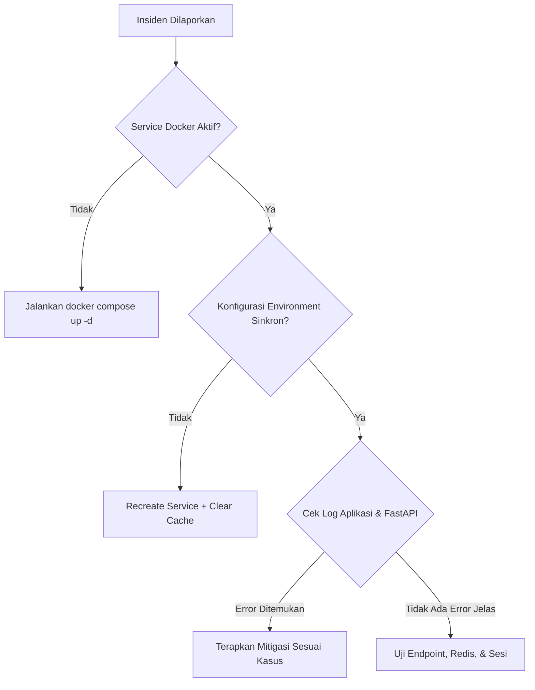

# Troubleshooting & Runbook Operasional

Panduan ini disusun sebagai langkah investigasi berurutan (Runbook) untuk tim DevOps dan Security Engineers dalam mendiagnosis masalah pada _AI Auth System_.

## Alur Diagnostik Insiden



## Kasus 1: Error "429 Too Many Requests" Terus Menerus

### Gejala
Pengguna atau API Client tidak bisa melakukan login sama sekali dan selalu menerima response HTTP `429 Too Many Attempts` atau pesan "Terlalu banyak percobaan login gagal".

### Analisa Penyebab
1. Ada serangan _brute-force_ aktif dari IP pengguna tersebut.
2. Konfigurasi `MAX_LOGIN_ATTEMPTS` terlalu rendah.
3. Kunci _rate limiter_ di Redis belum kadaluwarsa (terkunci manual).

### Mitigasi (Runbook)
1. **Analisa Log Serangan**: Periksa apakah ada lonjakan _traffic_.
   ```bash
   docker compose exec -T app grep "Brute force attempt blocked" storage/logs/laravel.log
   ```
2. **Clear Rate Limiter Cache**: Jika ini adalah _false positive_, Anda bisa menghapus kunci rate limiter spesifik di Redis, atau mem-flush seluruh cache.
   ```bash
   # Membersihkan seluruh cache (Hati-hati di Production!)
   docker compose exec -T app php artisan cache:clear
   ```

## Kasus 2: Perubahan `.env` Tidak Teraplikasi

### Gejala
Anda sudah mengubah nilai pada `.env` (misal: `AI_RISK_TIMEOUT`), namun sistem masih menggunakan nilai lama.

### Mitigasi (Runbook)
_Environment variable_ yang diperbarui di host tidak akan otomatis terbaca oleh container yang sudah berjalan, apalagi jika _config cache_ Laravel aktif.

1. Terapkan konfigurasi ulang dan bersihkan cache:
   ```bash
   docker compose up -d --force-recreate app worker scheduler
   docker compose exec -T app php artisan config:clear
   docker compose exec -T app php artisan cache:clear
   ```

## Kasus 3: AI Engine Timeout / Fallback Terus Menerus

### Gejala
Login terasa sangat lambat (lebih dari 3 detik) dan pengguna selalu diarahkan ke MFA meskipun login dari perangkat yang sama. Log Laravel menunjukkan `AI Risk Engine Unreachable`.

### Analisa Penyebab
Service `fastapi-risk` mati, mengalami _crash_, atau konektivitas jaringan internal Docker antar container terputus.

### Mitigasi (Runbook)
1. **Cek Status Service**:
   ```bash
   docker compose ps
   ```
2. **Periksa Log AI Engine**:
   ```bash
   docker compose logs --tail=200 fastapi-risk
   ```
3. **Validasi Konektivitas Internal**: Pastikan container Laravel bisa melakukan _ping_ atau _curl_ ke FastAPI.
   ```bash
   docker compose exec -T app curl -v http://fastapi-risk:8000/docs
   ```

## Kasus 4: Error "Class 'Redis' not found" pada Artisan

### Gejala
Saat menjalankan perintah artisan (contoh: `php artisan cache:clear`), muncul error ekstensi Redis tidak ditemukan.

### Mitigasi (Runbook)
Masalah ini terjadi karena Anda menjalankan perintah di mesin _Host_ yang tidak memiliki ekstensi PHP Redis. Selalu jalankan perintah _Artisan_ di dalam container `app`:

```bash
# BENAR
docker compose exec -T app php artisan cache:clear

# SALAH (Jangan Lakukan Ini)
php artisan cache:clear
```

## Daftar Perintah Diagnostik Penting

Simpan perintah ini untuk kebutuhan audit harian:

```bash
# Mengecek keseluruhan status infrastruktur
docker compose ps

# Mengikuti log utama aplikasi (Real-time tailing)
docker compose logs -f app

# Mengikuti log AI Security Engine
docker compose logs -f fastapi-risk

# Memeriksa rute autentikasi yang aktif
docker compose exec -T app php artisan route:list --path=auth
```
