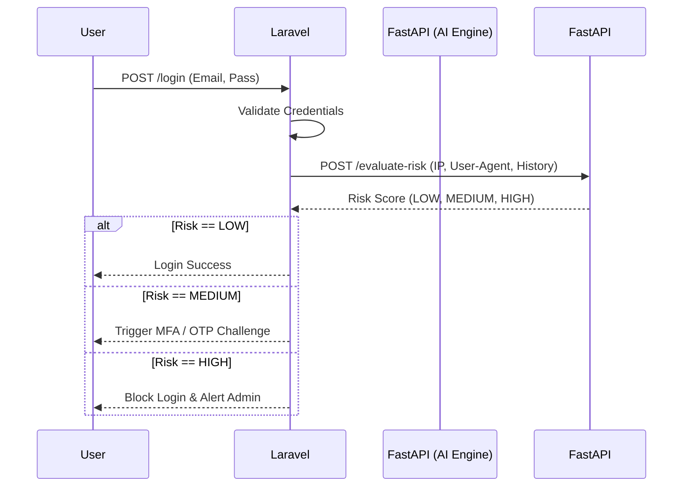

# AI Risk Scoring Engine

Jantung dari keamanan adaptif AI Auth System terletak pada **Risk Engine** terpisah yang dibangun menggunakan Python (FastAPI). Engine ini bertugas menganalisa jejak (footprint) dari pengguna saat mencoba login untuk menentukan apakah perilaku tersebut terindikasi mencurigakan.

## Arsitektur Integrasi

Sistem backend Laravel tidak melakukan kalkulasi *Machine Learning* secara langsung. Laravel mendelegasikan tugas komputasi berat ini ke _Microservice_ Risk Engine.



## Parameter yang Dianalisa (Features)

Model AI di sisi FastAPI mengevaluasi beberapa _features_ berikut secara real-time:
1. **Kecepatan Ketikan (Typing Biometrics)**: Jika tersedia dari interaksi frontend.
2. **Velocity Velocity**: Seberapa cepat sebuah IP berpindah geografis secara tidak wajar (Contoh: Login dari Jakarta, 5 menit kemudian login dari Rusia - _Impossible Travel_).
3. **Reputasi IP (Threat Intelligence)**: Apakah IP tersebut merupakan bagian dari Botnet yang diketahui atau TOR Exit Nodes.
4. **Anomali Waktu Login**: Jika pengguna biasanya login jam 08:00 pagi, tapi tiba-tiba login pada pukul 03:00 dini hari.

## Implementasi Komunikasi API

Di dalam Laravel, integrasi dilakukan menggunakan `Http` client façade dengan mekanisme *fallback* jika server AI mati.

**Kode Implementasi:**
```php {8,14-16}
// app/Modules/Security/Services/AiRiskService.php

public function evaluate(User $user, Request $request): RiskProfile {
    try {
        $response = Http::timeout(3)->post(config('services.ai_risk.url') . '/evaluate-risk', [
            'user_id' => $user->id,
            'ip_address' => $request->ip(),
            'user_agent' => $request->header('User-Agent'),
            'timestamp' => now()->toIso8601String()
        ]);

        return new RiskProfile($response->json());
    } catch (\Exception $e) {
        Log::error('AI Risk Engine Unreachable', ['error' => $e->getMessage()]);
        // Fail-open strategy: jika AI mati, berikan akses medium (wajib MFA)
        return new RiskProfile(['level' => 'MEDIUM', 'reason' => 'Engine fallback']);
    }
}
```

::: danger Kebijakan Fallback (Fail-Open vs Fail-Closed)
Pada kode di atas, sistem menggunakan strategi **Fail-Open dengan penalti**, yang berarti jika layanan AI mati/timeout, sistem akan mengembalikan status `MEDIUM` sehingga **pengguna tetap bisa masuk melalui MFA**, alih-alih me-lock (Fail-Closed) sistem sepenuhnya yang dapat menyebabkan _Denial of Service (DoS)_.
:::

## Tuning Model AI

Operasional dari Engine FastAPI melibatkan parameter `THRESHOLD` yang dapat diatur oleh DevOps atau Security Engineer.

- Skor `0.0 - 0.4`   : `LOW RISK`
- Skor `0.41 - 0.79` : `MEDIUM RISK`
- Skor `0.8 - 1.0`   : `HIGH RISK`

Sesuaikan parameter ini pada environment variabel layanan FastAPI Anda.
